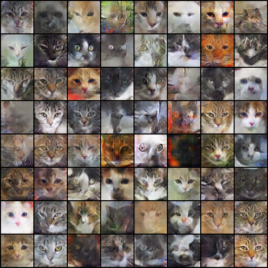
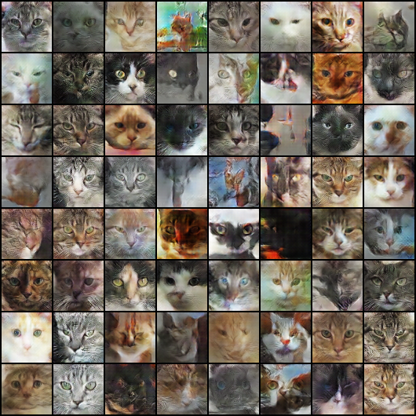
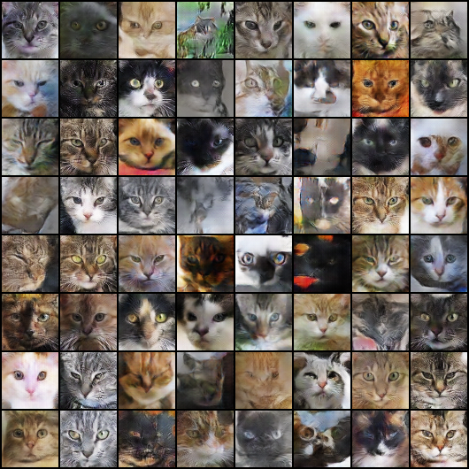
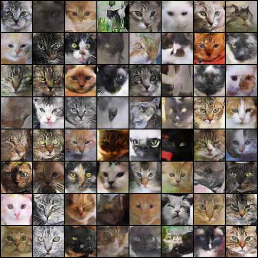
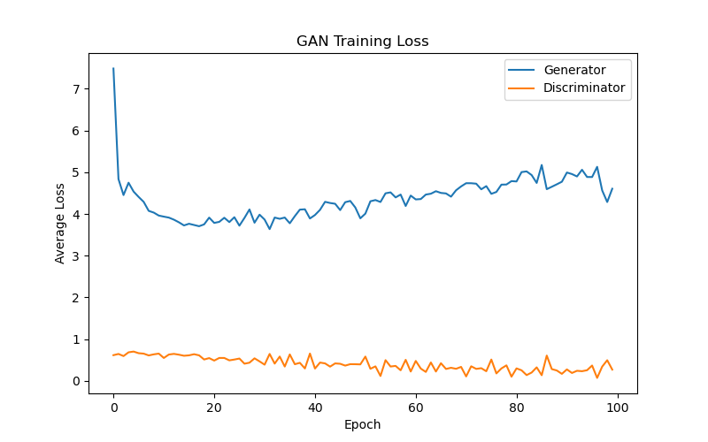

# Cat Face Generation with DCGAN

A Deep Convolutional Generative Adversarial Network (**DCGAN**) implemented with **PyTorch** to generate synthetic 64×64 RGB cat-face images.

The model was trained on the [Cat Faces Dataset](https://www.kaggle.com/datasets/veeralakrishna/cat-faces-dataset), which contains approximately 29,843 cropped cat-face images collected and preprocessed from multiple public datasets.


## Model Architecture

The project follows the standard DCGAN design.

### Generator

The generator receives a random latent vector of size `100 × 1 × 1` and progressively upsamples it into a `3 × 64 × 64` RGB image using transposed convolutions.

| Layer | Output shape | Activation |
|---|---:|---|
| Input latent vector | `100 × 1 × 1` | — |
| ConvTranspose2d | `512 × 4 × 4` | BatchNorm + ReLU |
| ConvTranspose2d | `256 × 8 × 8` | BatchNorm + ReLU |
| ConvTranspose2d | `128 × 16 × 16` | BatchNorm + ReLU |
| ConvTranspose2d | `64 × 32 × 32` | BatchNorm + ReLU |
| ConvTranspose2d | `3 × 64 × 64` | Tanh |

### Discriminator

The discriminator receives a `3 × 64 × 64` image and reduces it to a single probability indicating whether the image is real or generated.

| Layer | Output shape | Activation |
|---|---:|---|
| Input image | `3 × 64 × 64` | — |
| Conv2d | `64 × 32 × 32` | LeakyReLU |
| Conv2d | `128 × 16 × 16` | BatchNorm + LeakyReLU |
| Conv2d | `256 × 8 × 8` | BatchNorm + LeakyReLU |
| Conv2d | `512 × 4 × 4` | BatchNorm + LeakyReLU |
| Conv2d | `1 × 1 × 1` | Sigmoid |

## Training Configuration

| Parameter | Value |
|---|---:|
| Image size | `64 × 64` |
| Channels | `3` |
| Latent dimension | `100` |
| Batch size | `128` |
| Epochs | `100` |
| Learning rate | `0.0002` |
| Adam β1 | `0.5` |
| Adam β2 | `0.999` |
| Loss function | Binary Cross-Entropy |
| Random seed | `42` |
| Checkpoint interval | Every 25 epochs |

The code automatically uses CUDA when a compatible GPU is available; otherwise, it runs on the CPU.
> [!IMPORTANT]
> It is highly recommended that you have a decent GPU for this project.

## Data Preparation

Extract the images into the three folders expected by the script:

```text
project-root/
├── cat_gan.py
├── dataset-part1/
├── dataset-part2/
├── dataset-part3/
└── gan_outputs/
```

The custom `FlatImageDataset` class scans these directories recursively, so class-specific subfolders are not required.

## Requirements
 
```
torch
torchvision
pillow
matplotlib
tqdm
```

Install the required packages:

```bash
pip install torch torchvision pillow matplotlib tqdm
```

During training, the progress bar displays:

- Discriminator loss: `Loss_D`
- Generator loss: `Loss_G`
- Discriminator confidence on real images: `D(x)`
- Discriminator confidence on generated images before and after the generator update: `D(G(z))`

## Saved Outputs

The script creates the `gan_outputs` directory automatically and saves:

```text
gan_outputs/
├── best_netG.pth
├── netG_epoch_25.pth
├── netG_epoch_50.pth
├── netG_epoch_75.pth
├── netG_epoch_100.pth
├── netD_epoch_25.pth
├── netD_epoch_50.pth
├── netD_epoch_75.pth
├── netD_epoch_100.pth
├── training_state_epoch_25.pth
├── training_state_epoch_50.pth
├── training_state_epoch_75.pth
├── training_state_epoch_100.pth
├── sample_epoch_25.png
├── sample_epoch_50.png
├── sample_epoch_75.png
├── sample_epoch_100.png
└── loss_curve.png
```

`best_netG.pth` stores the generator checkpoint with the lowest average generator loss observed during training.

## Image Preprocessing

Each image is processed using the following pipeline:

1. Resize to 64 pixels.
2. Center-crop to `64 × 64`.
3. Convert to a PyTorch tensor.
4. Normalize RGB values from `[0, 1]` to `[-1, 1]`.

The final normalization matches the generator's `Tanh` output layer.

## Generated Samples

The same fixed latent vectors were used at every checkpoint, making it easier to observe how the generated images changed during training.

| Epoch 25 | Epoch 50 |
|---|---|
|  |  |

| Epoch 75 | Epoch 100 |
|---|---|
|  |  |

## Training Loss



The discriminator loss decreases during training, while the generator loss initially drops and later increases. This indicates that the discriminator becomes increasingly confident and may learn faster than the generator. Although the generated samples contain recognizable cat-like features, some images remain blurry or contain visual artifacts.


